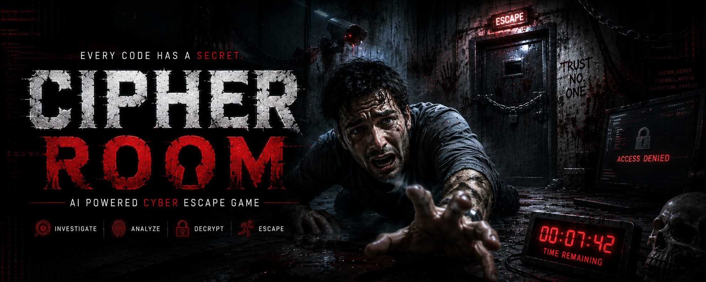
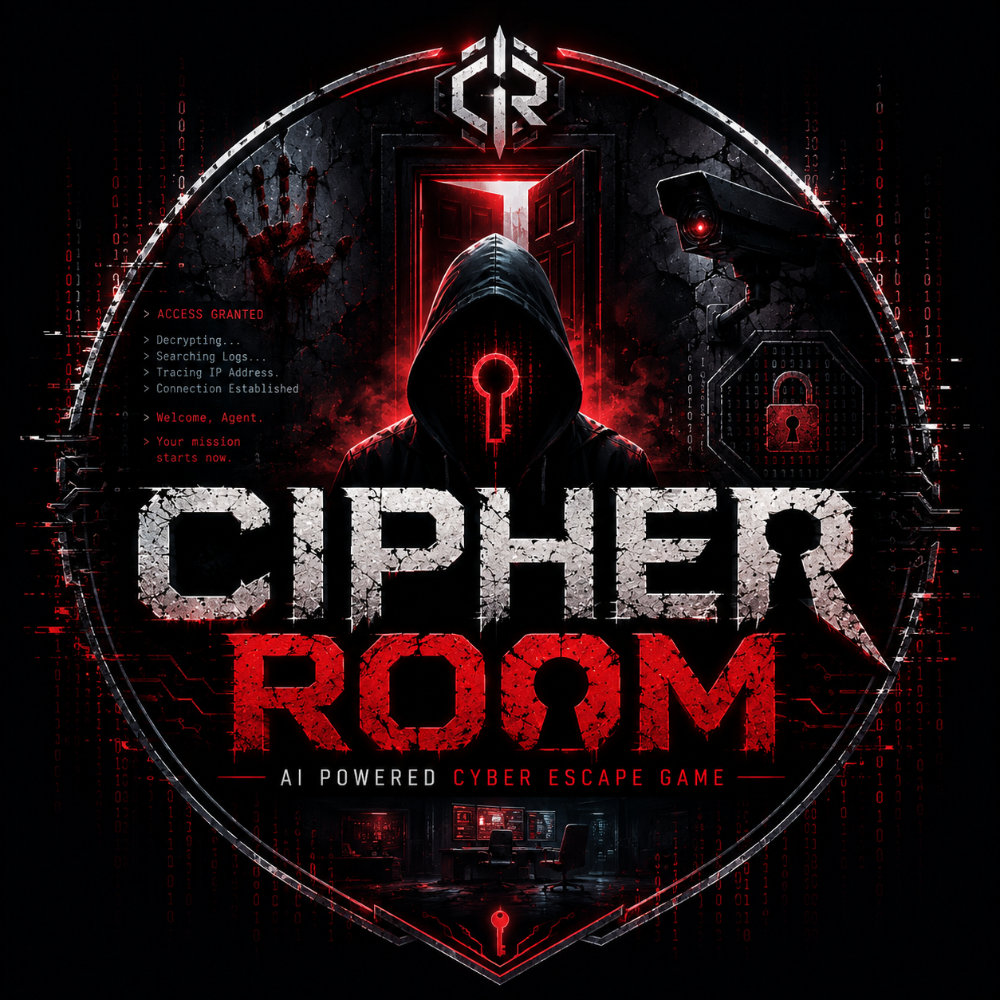
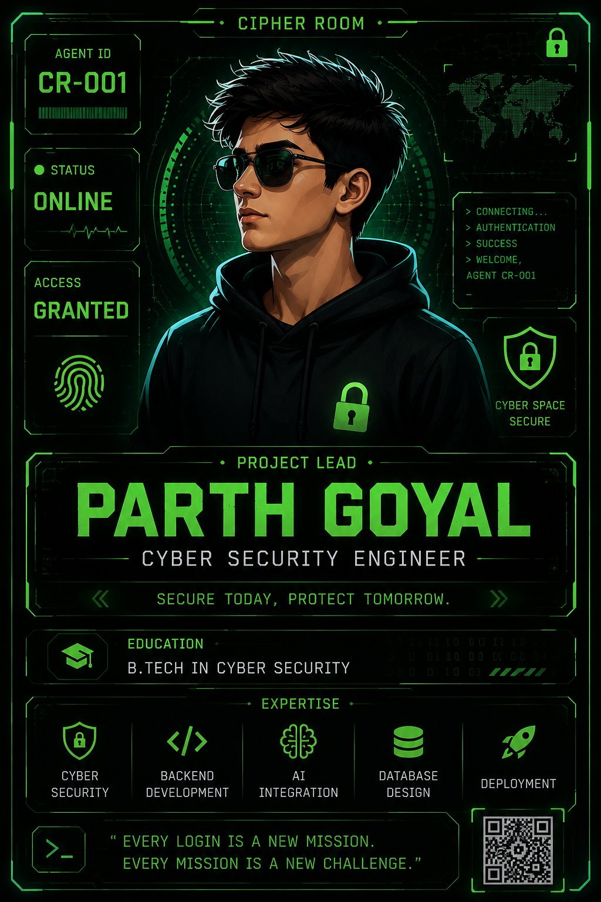
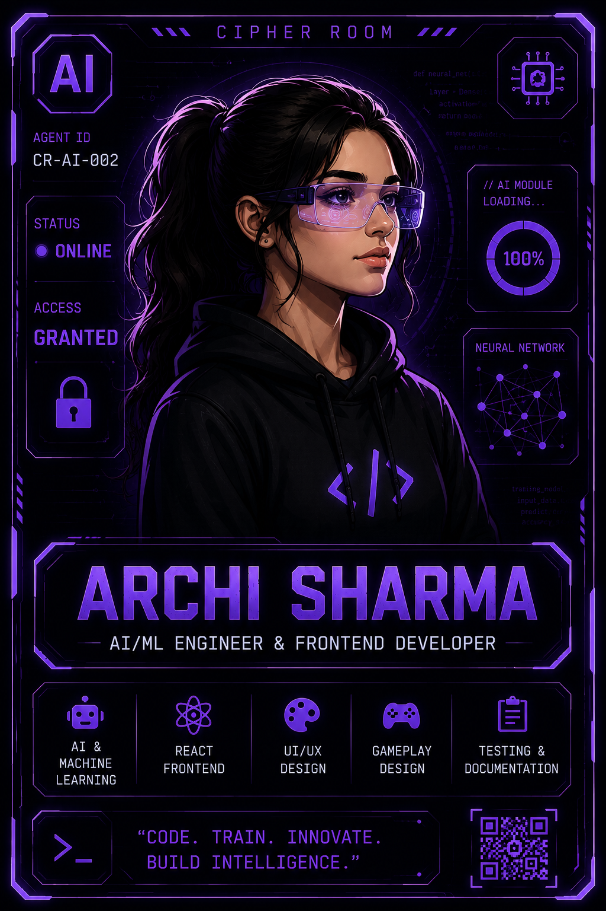

<div align="center">



<br><br>

<p align="center">
  
</p>

# 🔐 CIPHER ROOM

### AI Powered Cyber Escape Room



### 💜 Made with ❤️ by Team Cipher Room

### 👨‍💻 Parth Goyal • Archi Sharma

<br>


</div>

---

<div align="center">

# 🌌 Every Login. Every Mission. Every Cipher.

### *"The system doesn't wait for heroes... it creates investigators."*

</div>

---

# 🚀 Welcome to Cipher Room

**Cipher Room** is an **AI-powered cyber escape room** where every login launches a completely new investigation.

Unlike traditional escape games, Cipher Room dynamically generates fresh missions using **Artificial Intelligence**, ensuring every player experiences a unique storyline, new puzzles, hidden clues, and realistic cybersecurity challenges.

From decrypting encrypted files and analyzing digital evidence to cracking passwords and investigating cyber attacks, every mission is designed to sharpen problem-solving skills while delivering an immersive gaming experience.

Whether you're a student, cybersecurity enthusiast, or puzzle lover, Cipher Room turns learning into an exciting adventure.

---

<div align="center">

# ⚡ Mission Flow

```text
            🚪 LOGIN
               │
               ▼
      🤖 ARES AI ACTIVATES
               │
               ▼
      🎯 GENERATE NEW MISSION
               │
               ▼
      🔍 INVESTIGATE EVIDENCE
               │
               ▼
      🔐 SOLVE CYBER PUZZLES
               │
               ▼
      💻 DECRYPT FILES
               │
               ▼
         🚪 ESCAPE ROOM
```

</div>

---

<div align="center">

# ✨ Project Highlights

<table>

<tr>

<td align="center" width="25%">

🤖

### AI Generated

Unique missions every login

</td>

<td align="center" width="25%">

🔐

### Cyber Security

Real-world concepts & challenges

</td>

<td align="center" width="25%">

🎮

### Escape Gameplay

Interactive puzzle solving

</td>

<td align="center" width="25%">

♾️

### Infinite Replayability

Every mission is different

</td>

</tr>

</table>

</div>

---

<div align="center">

━━━━━━━━━━━━━━━━━━━━━━━━━━━━━━━━━━━━━━━━━━━━━━━━━━━━━━━━━━

### 🚀 Hack • Investigate • Decrypt • Escape

**Powered by Artificial Intelligence**

━━━━━━━━━━━━━━━━━━━━━━━━━━━━━━━━━━━━━━━━━━━━━━━━━━━━━━━━━━

⬇️ **Scroll Down to Explore the Project**

</div>

---
---

<div align="center">

# ⚡ About Cipher Room

### *An AI-powered cyber escape room where every mission is different.*

</div>

> **Cipher Room** transforms cybersecurity learning into an immersive escape-room experience. Instead of fixed puzzles, Artificial Intelligence generates a **brand-new mission every time you log in**, ensuring that every investigation feels fresh and unpredictable.

Players must think like real cyber investigators—collect digital evidence, decrypt encrypted files, analyze suspicious activities, crack passwords, and uncover the truth before time runs out.

---

<div align="center">

# 🌟 Why Cipher Room?

<table>
<tr>

<td align="center" width="25%">

🤖

### AI Generated

Fresh missions every login

</td>

<td align="center" width="25%">

🔐

### Cyber Learning

Real cybersecurity concepts

</td>

<td align="center" width="25%">

🎮

### Interactive Gameplay

Story-driven escape missions

</td>

<td align="center" width="25%">

♾️

### Unlimited Replay

No two missions are the same

</td>

</tr>
</table>

</div>

---

<div align="center">

# 👥 Meet Team Cipher Room

### *The minds behind Cipher Room*

<table>

<tr>

<td align="center" width="50%">



<br>

### 🛡️ Parth Goyal

**Project Lead**

Backend Development • Cyber Security • API Integration • Deployment

</td>

<td align="center" width="50%">



<br>

### 🤖 Archi Sharma

**AI & Creative Lead**

AI/ML • Frontend • UI/UX • Gameplay Design • Documentation

</td>

</tr>

</table>

</div>

---

<div align="center">

# 🤖 Meet ARES AI

### **Autonomous Response & Escape System**

</div>

ARES AI is the intelligent core of Cipher Room.

It generates unique cyber investigations, adapts mission difficulty, provides contextual hints, and creates dynamic storylines that make every escape completely different.

Instead of replaying identical levels, players experience a brand-new adventure every time they log in.

---

<div align="center">

## 💻 ARES AI Terminal

```text
╔══════════════════════════════════════════════════════╗
║                 A R E S   A I                       ║
╠══════════════════════════════════════════════════════╣
║ > Initializing Secure Environment...               ║
║ > Connecting Intelligence Engine...                ║
║ > Loading Cyber Investigation Module...            ║
║ > Encrypting Mission Database...                   ║
║ > Generating Unique Mission...                     ║
║                                                    ║
║ ✔ Mission Successfully Created                     ║
║ ✔ Investigator Authentication Complete             ║
║                                                    ║
║ ► Welcome to Cipher Room                           ║
╚══════════════════════════════════════════════════════╝
```

</div>

---

<div align="center">

# 📖 Story

</div>

A classified research facility has suffered a devastating cyber attack.

Sensitive files have been encrypted, confidential data has disappeared, and an unknown hacker has infiltrated the network.

Working alongside **ARES AI**, your objective is to investigate digital evidence, uncover hidden clues, identify the attacker, and escape before the entire facility is permanently locked down.

Every investigation introduces a different storyline, new suspects, fresh puzzles, and unexpected twists.

---

<div align="center">

# 🎯 Cipher Room vs Traditional Escape Games

| Traditional Escape Room | 🔐 Cipher Room |
|:------------------------|:--------------|
| Same puzzles every time | ✅ AI-generated missions |
| Static storyline | ✅ Dynamic storytelling |
| Limited replay value | ✅ Infinite replayability |
| Basic hints | ✅ Intelligent AI assistance |
| One fixed ending | ✅ Multiple unique outcomes |

</div>

---

<div align="center">

━━━━━━━━━━━━━━━━━━━━━━━━━━━━━━━━━━━━━━━━━━━━━━━━━━━━━━

### 🚀 Every investigation begins with a single clue...

**⬇️ Continue to explore the gameplay experience ⬇️**

━━━━━━━━━━━━━━━━━━━━━━━━━━━━━━━━━━━━━━━━━━━━━━━━━━━━━━

</div>

---
---

<div align="center">

# ✨ Core Features

### *Built to deliver a realistic AI-powered cybersecurity adventure.*

</div>

<br>

<table>
<tr>

<td width="33%" align="center">

## 🤖 AI Generated Missions

Every login creates a completely new mission powered by Artificial Intelligence.

No repeated cases.

No repeated clues.

A brand-new investigation every time.

</td>

<td width="33%" align="center">

## 🔐 Cyber Investigation

Learn cybersecurity by solving realistic challenges inspired by real-world attacks.

• Password Cracking

• Digital Forensics

• Cryptography

• Network Analysis

</td>

<td width="33%" align="center">

## 🎮 Escape Experience

Search the facility.

Collect evidence.

Unlock systems.

Escape before time runs out.

</td>

</tr>

<tr>

<td align="center">

## 💡 Smart AI Assistant

ARES AI guides players with intelligent hints whenever they get stuck.

</td>

<td align="center">

## 🌍 Realistic Storytelling

Every mission includes a unique story, objectives and unexpected twists.

</td>

<td align="center">

## ♾️ Infinite Replayability

No two investigations are ever the same.

Every login starts a fresh experience.

</td>

</tr>

</table>

---

<div align="center">

# 🎮 Gameplay Journey

</div>

```text
╭─────────╮
│ 🚪 Login │
╰────┬────╯
     │
     ▼
╭──────────────╮
│ 🤖 ARES AI   │
│ Generates    │
│ New Mission  │
╰────┬─────────╯
     │
     ▼
╭──────────────╮
│ 🔍 Explore   │
│ Facility     │
╰────┬─────────╯
     │
     ▼
╭──────────────╮
│ 📂 Collect   │
│ Evidence     │
╰────┬─────────╯
     │
     ▼
╭──────────────╮
│ 🔐 Solve     │
│ Challenges   │
╰────┬─────────╯
     │
     ▼
╭──────────────╮
│ 💻 Decrypt   │
│ Files        │
╰────┬─────────╯
     │
     ▼
╭──────────────╮
│ 🚪 Escape    │
╰──────────────╯
```

---

<div align="center">

# 🎯 Mission Types

</div>

<table>

<tr>

<td align="center">

🔑

### Password Cracking

Recover hidden credentials using logic and analysis.

</td>

<td align="center">

🔐

### Cryptography

Decode encrypted messages and unlock secret files.

</td>

<td align="center">

📁

### Digital Forensics

Inspect logs, devices and digital evidence.

</td>

</tr>

<tr>

<td align="center">

🌐

### Network Investigation

Trace suspicious activity across connected systems.

</td>

<td align="center">

📧

### Phishing Detection

Identify fake emails and social engineering attacks.

</td>

<td align="center">

💾

### Data Recovery

Recover encrypted or deleted confidential information.

</td>

</tr>

</table>

---

<div align="center">

# 🚀 Why Players Love Cipher Room

<table>

<tr>

<td align="center">

🧠

### Think

Analyze clues like a cyber investigator.

</td>

<td align="center">

🔍

### Investigate

Explore systems and collect digital evidence.

</td>

<td align="center">

🧩

### Solve

Complete realistic cybersecurity challenges.

</td>

<td align="center">

🏆

### Escape

Finish the mission before the countdown ends.

</td>

</tr>

</table>

</div>

---

<div align="center">

# ⚡ Experience Includes

🧠 AI Story Generation &nbsp;&nbsp; • &nbsp;&nbsp;
🔐 Cyber Security Challenges &nbsp;&nbsp; • &nbsp;&nbsp;
🎮 Interactive Gameplay &nbsp;&nbsp; • &nbsp;&nbsp;
📂 Digital Investigation &nbsp;&nbsp; • &nbsp;&nbsp;
🤖 Smart Hint System &nbsp;&nbsp; • &nbsp;&nbsp;
♾️ Infinite Replayability

</div>

---

<div align="center">

━━━━━━━━━━━━━━━━━━━━━━━━━━━━━━━━━━━━━━━━━━━━━━━━━━━━━━

## 🚀 Every Login Begins A New Investigation

### **Hack • Investigate • Decrypt • Escape**

━━━━━━━━━━━━━━━━━━━━━━━━━━━━━━━━━━━━━━━━━━━━━━━━━━━━━━

</div>

---
---

<div align="center">

# ⚙️ Built With Modern Technologies

### *Powering the Future of AI-Powered Cyber Escape Rooms*

</div>

<br>

<div align="center">

| 🎨 Frontend | ⚙️ Backend | 🤖 AI | 🗄 Database |
|:-----------:|:----------:|:-----:|:----------:|
| React + Vite | FastAPI | Gemini API | SQLite |

| 🎭 Styling | 🌐 Deployment | 🔧 Tools | 🔐 Security |
|:----------:|:-------------:|:--------:|:-----------:|
| Tailwind CSS | Vercel + Render | Git & GitHub | JWT |

</div>

---

<div align="center">

# 🛠 Tech Stack


</div>

---

<div align="center">

# 🏗️ System Architecture

</div>

```text
                     👨‍💻 Player
                         │
                         ▼
          ┌──────────────────────────┐
          │      React Frontend      │
          └────────────┬─────────────┘
                       │
                API Requests
                       │
                       ▼
          ┌──────────────────────────┐
          │      FastAPI Backend     │
          └────────────┬─────────────┘
                       │
        ┌──────────────┴──────────────┐
        ▼                             ▼
🤖 Gemini AI                    🗄 SQLite Database
Mission Engine                 User Progress
        │                             │
        └──────────────┬──────────────┘
                       ▼
              🎯 Dynamic Mission
```

---

<div align="center">

# 📂 Project Structure

</div>

```text
Cipher-Room
│
├── 📁 assets
│   ├── 🖼 banner
│   ├── 👥 agents
│   ├── 🎥 demo
│   ├── 📸 screenshots
│   └── 🔐 logo
│
├── 📁 client
│   ├── components
│   ├── pages
│   ├── hooks
│   └── assets
│
├── 📁 server
│   ├── api
│   ├── database
│   ├── models
│   ├── services
│   └── utils
│
├── 📄 README.md
├── 📄 LICENSE
└── 📄 CONTRIBUTING.md
```

---

<div align="center">

# 🔄 How Cipher Room Works

</div>

```text
👤 Player
    │
    ▼
🚪 Login
    │
    ▼
🤖 ARES AI Generates Mission
    │
    ▼
🗂 Collect Evidence
    │
    ▼
🔍 Analyze Clues
    │
    ▼
🔐 Solve Challenges
    │
    ▼
🏆 Escape Successfully
```

---

<div align="center">

# 📈 Development Progress

</div>

| Module | Progress |
|---------|:--------:|
| 🎨 Frontend | 🟩🟩🟩🟩🟩🟩🟩🟩🟩⬜ 90% |
| ⚙️ Backend | 🟩🟩🟩🟩🟩🟩🟩⬜⬜⬜ 70% |
| 🤖 AI Integration | 🟩🟩🟩🟩🟩🟩⬜⬜⬜⬜ 60% |
| 🧩 Puzzle Engine | 🟩🟩🟩🟩🟩⬜⬜⬜⬜⬜ 50% |
| 🔐 Authentication | 🟩🟩🟩⬜⬜⬜⬜⬜⬜⬜ 30% |
| 🌍 Multiplayer | ⬜⬜⬜⬜⬜⬜⬜⬜⬜⬜ Planned |

---

<div align="center">

## 🚀 Tech Highlights

<table>

<tr>

<td align="center">

⚡

### Fast

Optimized React + Vite architecture

</td>

<td align="center">

🔒

### Secure

JWT Authentication & Protected APIs

</td>

<td align="center">

🤖

### Smart

Gemini AI generates dynamic missions

</td>

<td align="center">

📈

### Scalable

Modular backend with FastAPI

</td>

</tr>

</table>

</div>

---

<div align="center">

━━━━━━━━━━━━━━━━━━━━━━━━━━━━━━━━━━━━━━━━━━━━━━━━━━━━━━

### 💻 Modern Stack • AI Powered • Built for Cybersecurity

**⬇️ Next: Installation & Live Demo ⬇️**

━━━━━━━━━━━━━━━━━━━━━━━━━━━━━━━━━━━━━━━━━━━━━━━━━━━━━━

</div>
---

<div align="center">

# 🚀 Launch Cipher Room

### *Clone • Configure • Deploy • Escape*

</div>

---

<div align="center">

<table>

<tr>

<td align="center" width="25%">

## 📥

### Clone

Download the repository

</td>

<td align="center" width="25%">

## 📦

### Install

Install dependencies

</td>

<td align="center" width="25%">

## ⚙️

### Configure

Setup environment variables

</td>

<td align="center" width="25%">

## 🚀

### Launch

Start your investigation

</td>

</tr>

</table>

</div>

---

# 📥 Clone Repository

```bash
git clone https://github.com/<your-username>/Cipher-Room.git

cd Cipher-Room
```

---

# 📦 Install Dependencies

### 🎨 Frontend

```bash
cd client

npm install
```

### ⚙️ Backend

```bash
cd ../server

pip install -r requirements.txt
```

---

# 🔑 Environment Variables

Create a **.env** file inside the **server** directory.

```env
GEMINI_API_KEY=YOUR_API_KEY

SECRET_KEY=YOUR_SECRET_KEY

DATABASE_URL=sqlite:///cipherroom.db
```

---

# ▶️ Run the Project

### Start Backend

```bash
cd server

uvicorn main:app --reload
```

### Start Frontend

```bash
cd client

npm run dev
```

---

<div align="center">

# 🌐 Open in Browser

```text
http://localhost:5173
```

</div>

---

<div align="center">

# 🎥 Gameplay Preview


</div>

---

<div align="center">

# 📸 Project Gallery

<table>

<tr>

<td align="center">


### 🏠 Home

</td>

<td align="center">


### 🎯 Mission

</td>

<td align="center">


### 🎮 Gameplay

</td>

</tr>

</table>

</div>

---

<div align="center">

# ❤️ Support Cipher Room

<table>

<tr>

<td align="center" width="33%">

⭐

## Star

Support the project

</td>

<td align="center" width="33%">

🍴

## Fork

Create your own version

</td>

<td align="center" width="33%">

🤝

## Contribute

Help improve Cipher Room

</td>

</tr>

</table>

</div>

---

<div align="center">

# 🌟 Built for Everyone

🧑‍🎓 Students

🛡️ Cyber Security Learners

🤖 AI Enthusiasts

🎮 Puzzle Solvers

💻 Developers

</div>

---

<div align="center">

━━━━━━━━━━━━━━━━━━━━━━━━━━━━━━━━━━━━━━━━━━━━━━━━━━━━━━━━━━

### ⭐ Every Star Encourages Us To Build Better Experiences ⭐

**⬇️ Scroll Down For The Roadmap & Team ⬇️**

━━━━━━━━━━━━━━━━━━━━━━━━━━━━━━━━━━━━━━━━━━━━━━━━━━━━━━━━━━

</div>

---
---

<div align="center">

# 🗺️ Roadmap

### *The Mission Has Only Just Begun...*

</div>

<br>

| 🚀 Phase | Status | Features |
|:---------|:------:|:---------|
| **Phase 1** | ✅ | Landing Page • Core Gameplay • Authentication |
| **Phase 2** | 🚧 | AI Mission Generator • Smart Hint System |
| **Phase 3** | 🔜 | Digital Forensics • Cryptography • Network Labs |
| **Phase 4** | 💡 | Multiplayer • Global Leaderboards • Community Missions |

---

<div align="center">

# 🤝 Contributing

We welcome developers, cybersecurity enthusiasts, designers, and learners to improve Cipher Room.

<table>

<tr>

<td align="center">

⭐

### Star

Support the Project

</td>

<td align="center">

🍴

### Fork

Build Your Own Version

</td>

<td align="center">

🚀

### Pull Request

Improve Cipher Room

</td>

<td align="center">

🐞

### Report Issues

Help Us Improve

</td>

</tr>

</table>

</div>

---

<div align="center">

# ❤️ Why Cipher Room?

```
✔ AI Generated Missions
✔ Real Cybersecurity Challenges
✔ Interactive Escape Gameplay
✔ Infinite Replayability
✔ Learn While Playing
✔ Open Source
```

</div>

---

<div align="center">

# 💙 Thank You

*"Every investigation starts with curiosity.*  
*Every solution begins with a clue."*

</div>

---

<div align="center">


<br>

# 🔐 CIPHER ROOM

### Every Login • Every Mission • Every Cipher


<br>

### 💜 Made with ❤️ by Team Cipher Room

## 👨‍💻 Parth Goyal • Archi Sharma

<br>


<br><br>

━━━━━━━━━━━━━━━━━━━━━━━━━━━━━━━━━━━━━━━━━━━━━━

## ⭐ If You Like Cipher Room,

### Give this repository a ⭐ and join the mission.

━━━━━━━━━━━━━━━━━━━━━━━━━━━━━━━━━━━━━━━━━━━━━━

### 🚀 One Mission • Two Minds • Infinite Possibilities

</div>

---

---
